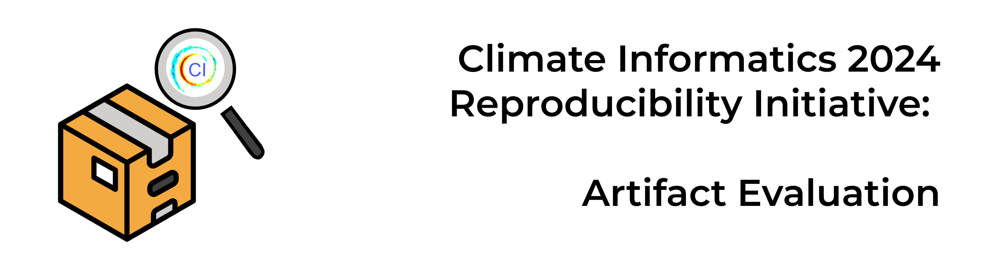

# About
This repository contains the documentation of [the 2024 Climate Informatics Artifact Evaluation Initiative](https://alan-turing-institute.github.io/climate-informatics-2024/artefact-evaluation/).

The content of this repository (folder `docs`) is rendered as an online document using [Jupyter Book](https://jupyterbook.org/en/stable/intro.html). 

**You can access it [here](https://alan-turing-institute.github.io/climate-informatics-2024-ae/)**.

## How to Cite
The material is licensed for free and open consumption and reuse under Creative Commons BY 4.0 (CC BY 4.0). 

The source code is released on GitHub and archived on Zenodo. This DOI will always resolve to the latest release:

          

## Acknowledgments 🙌 

### Organising Committee
This work was led by the [Reproducibility working group](https://alan-turing-institute.github.io/climate-informatics-2024/team#reproducibility) of the Climate Informatics 2024 organisers.

### Program Committee
We thank the program committee for being available to review the submitted artifacs!

- Alexandra Udaltsova (Open Climate Fix)
- Bryn Noel Ubald (British Antarctic Survey)
- Etienne Roesch (University of Reading)
- James Emberton (ICCS, University of Cambridge)
- James Robinson (Alan Turing Institute)

### Organisations
Climate Informatics 2024 Artifact Evaluation is hosted by the [Climate Informatics](http://www.climateinformatics.org) community with support from [Cambridge University Press & Assessment](https://www.cambridge.org), [The Alan Turing Institute](https://www.turing.ac.uk) and [The Institute of Computing for Climate Science](https://iccs.cam.ac.uk).
